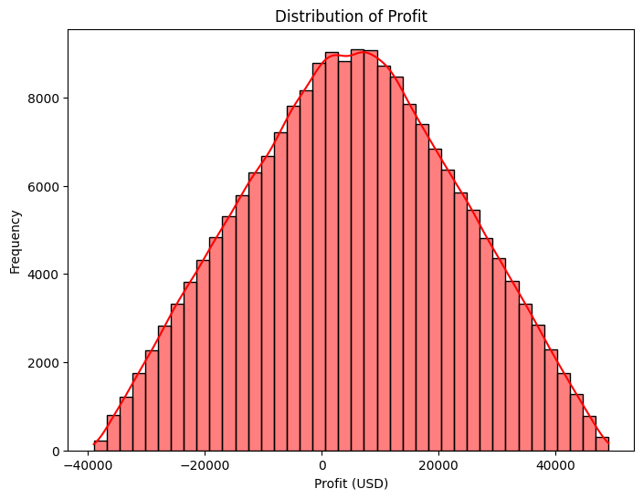
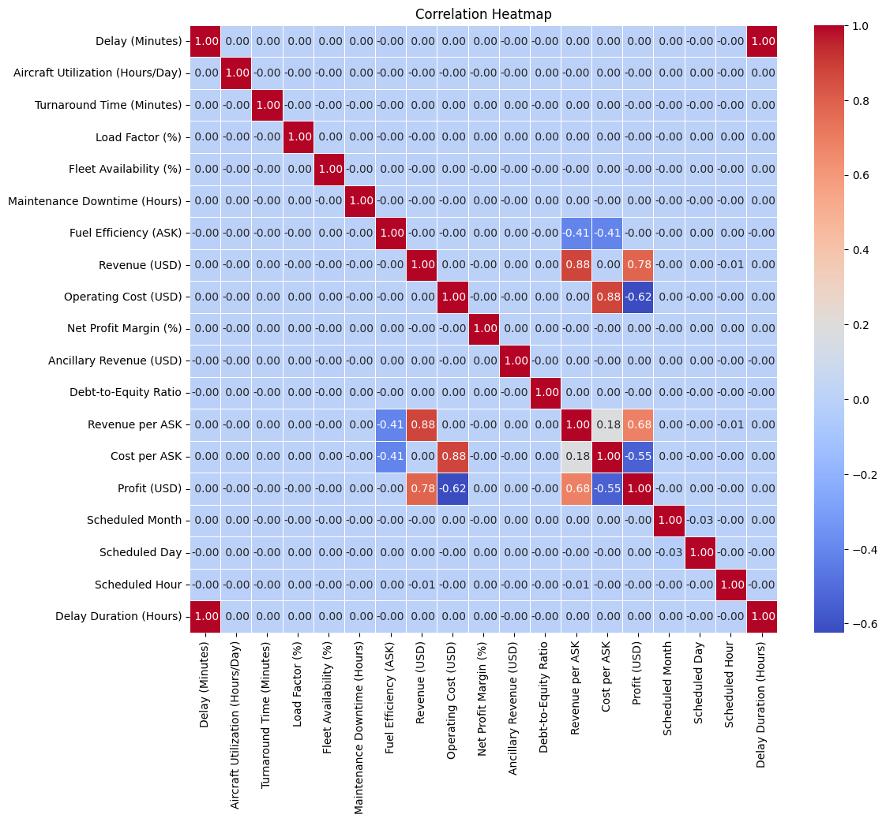

# ✈️ Airline Profitability Prediction  

## 📌 Project Overview  
This project predicts **airline profitability** based on various factors like **flight delays, aircraft utilization, fuel efficiency, and operational costs**.  
Using **Machine Learning**, it helps airlines **optimize operations** and **maximize profits**.  

---

## 🚀 Tech Stack  
- **Python** 🐍  
- **Pandas, NumPy, Matplotlib, Seaborn** 📊  
- **Scikit-learn** 🤖  
- **Machine Learning (Regression Models)**  
- **Google Colab**  

---

## 💂️ Dataset Information  
- **Features Used:**  
  - ✈️ Flight Delays  
  - ⏳ Turnaround Time  
  - ⛽ Fuel Efficiency  
  - 💰 Revenue & Operating Costs  
  - 🔧 Maintenance Downtime  
- **Target Variable:** `Profit (USD)`

---

## 📊 Data Analysis & Visualization  
🔹 **Exploratory Data Analysis (EDA) done on:**  
👉 Missing Values  
👉 Correlation Matrix  
👉 Feature Distributions  
👉 Outliers  

📉 **Visualizations Used:**  
- Bar Charts, Histograms, Box Plots, Heatmaps  

### **🎨 Visuals**
#### **📊 Model Performance**  


#### **🔍 Feature Importance**  


---

## 🏗️ Model Building  
1️⃣ **Preprocessing:** Handled missing values, feature scaling  
2️⃣ **Model Selection:** Tried Multiple Regression Models  
3️⃣ **Performance Metrics:** Used **R² Score, MSE, RMSE**  
4️⃣ **Final Model:** Selected the best-performing model  

---

## 🌟 Key Insights  
👉 **Load Factor & Aircraft Utilization** heavily impact profits  
👉 **Fuel Efficiency & Operating Costs** have a strong negative impact  
👉 **Delays increase costs & reduce profitability**  

---

## 📅 How to Run the Project  
1️⃣ Clone the repository:  
```sh  
git clone https://github.com/Madhav-Ganorkar/Airline_Profit_Prediction
```
2️⃣ Install dependencies:  
```sh  
pip install -r requirements.txt  
```
3️⃣ Run the notebook in **Google Colab or Jupyter Notebook**  

---

## 📚 Results  
- ✅ **Trained model achieves high accuracy**  
- ✅ **Business insights provided for better decision-making**  

---

## 🤝 Contributor  
- [Madhav Ganorkar](https://github.com/Madhav-Ganorkar)  

---

## ⭐ If you liked this project, give it a star ⭐  


